# Estructura de carpetas 

- css
- js
- Multimedia
- habitaciones.html
- index.html
- location.html
- login.html

Sigo una estructura de carpetas muy sencilla, en la que coloco cada archivo en su carpeta segun el formato, imagenes en Multimedia , css en css.. Y en la carpeta raíz dejo la documentación README.md y los html

# Tecnologías 

En este página web hay tecnologías muy innovadoras gracias a la implementación de javascript. Gran mención a:

## Widget 

Este widget es el orbe situado en la parte inferior derecha que te permite dejar comentarios a la página en todo momento con su propiedad sticky.

## Modo Oscuro

Este botón tambien sticky situado en la parte superior derecha se encarga de que en todo momento puedas cambiar el estilo de la web a uno de colores más oscuros , además al entrar en la web el javascript se encarga de ver si en tu sistema operativo utilizas el modo oscuro para adaptarlo nada más entrar.

## Notificaciones y elementos dinámicos

Nada más entrar a la web se activa un temporizador de 10 segundos que se encarga de dejarte una notificación situada en la parte superior izquierda de la web , con la propiedad sticky para que la veas siempre, que con un simple click podrás eliminar para que despues de 10 segundos vuelva a salir.

Además al entrar a la web tendras un slide que surge de la parte inferior de la web , dejandote la opcion de acpetar o rechazar las cookies. Esta funcion de javascript es funcional y guarda tu decisión para no volver a preguntarte , pero al ser un archivo local no guarda tu decisión.

También tienes en la parte superior de la página un bloque de texto en movimiento hablando de los "descuentos de la web" 

## Carrusel

Mi página web al ser orientada a un hotel, hay muchisimos carrusel de imagenes mostrando distintas habitaciones o instalaciones de hotel, que cambian automáticamente de imagen para el usuario , además de contar con una flechita para cambiar. Para esta parte he utilizado librerias de boostrap y js que me facilitaban la creación de los carrusel

## Formularios

Por último mencionar la joya de la corona , los formularios. Como no podía faltar en un hotel tienes un formulario de reserva de hotel con restricciones de fechas inversas o ya pasadas de la actual. Tambien hay una página web login.html dedicada para un formulario de registro con restricciones de correo y contraseña.

Y por último el formulario de contacto en la parte inferior de index.html. Además del formulario tipo texto que tiene el widget antes mencionado.

# Características 

Las carácteristicas que definen esta web son:  dinámica , colorida , útil y muy visual. Centrandome en las múltiples opciones de carrusel que tiene , mucha información dinámica ( notificaciones , cookies, widget , modo oscuro y Menu) Con una elección de colores muy suave para el usuario con tonos marrones en su version clara y tonos grises en su versión oscura.

- Notificación cada 10 segundos en esquina superior izquierda
- Notificación de cookies en la parte inferior
- Diseño responsive en todas las páginas adaptada a muchos dispositivos
- Estética y colores adaptados a 2024
- Carrusel de imágenes
- Formulario de reserva ( con cambio de imagenes segun la habitación a reservar), login y contacto con restricciones de input
- Menus desplegables en el nav y reserva
- Modo oscuro 
- Texto en movimiento en la parte superior de la página
- Cambios de color al situar el ratón sobre botones o elementos del nav

# Imagenes de partes importantes de la página

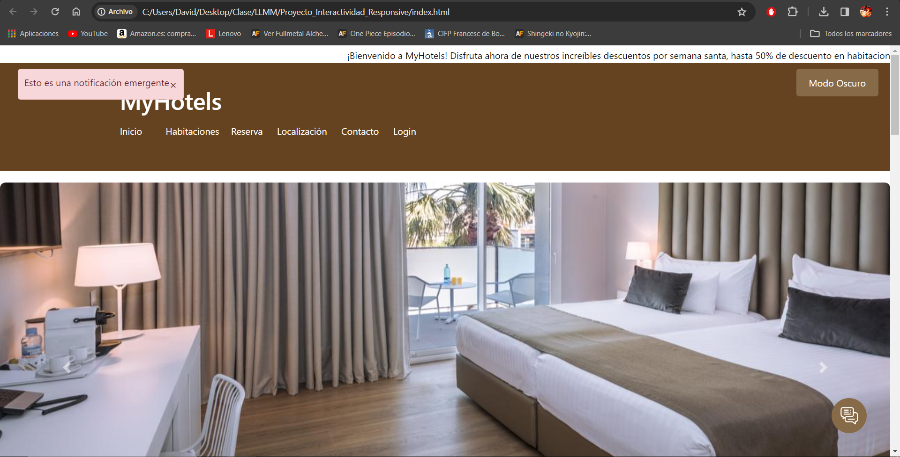
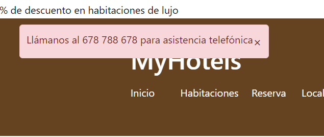
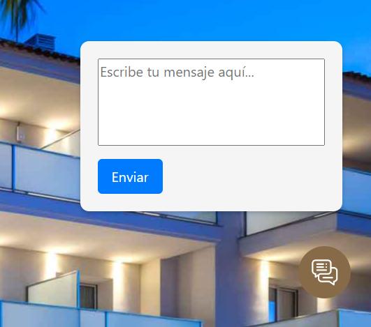
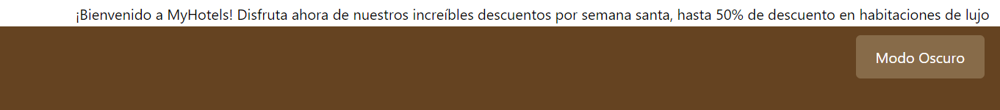
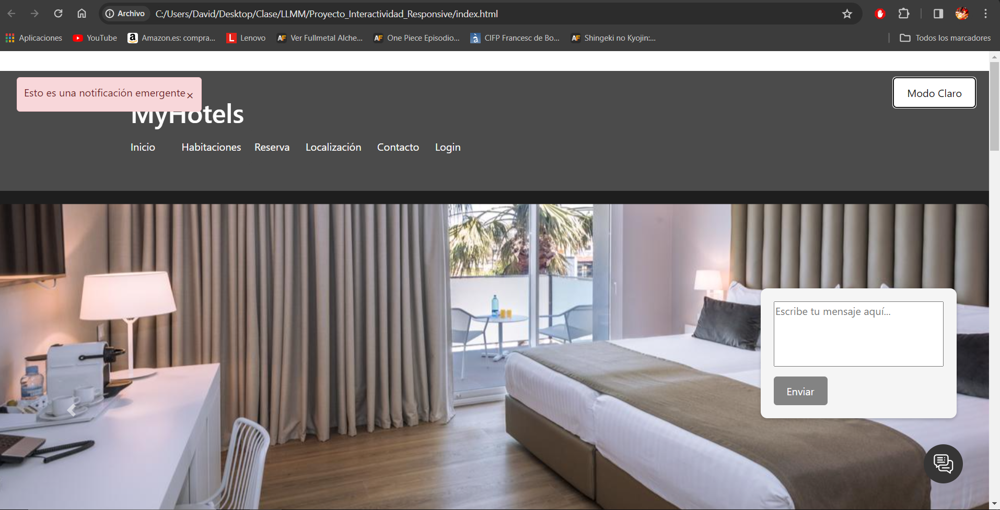
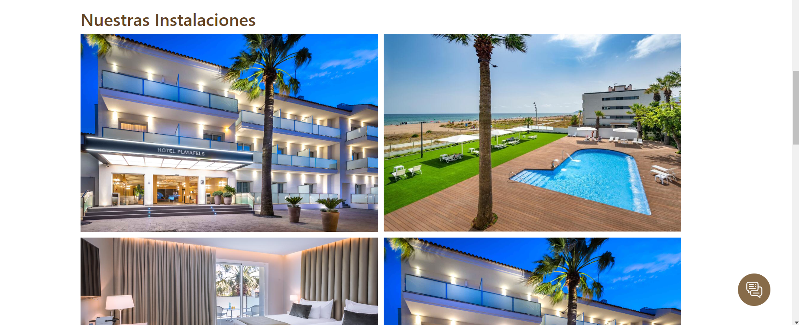
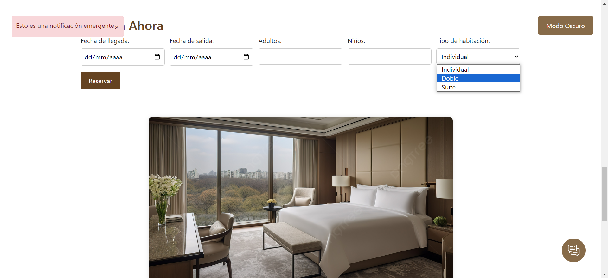
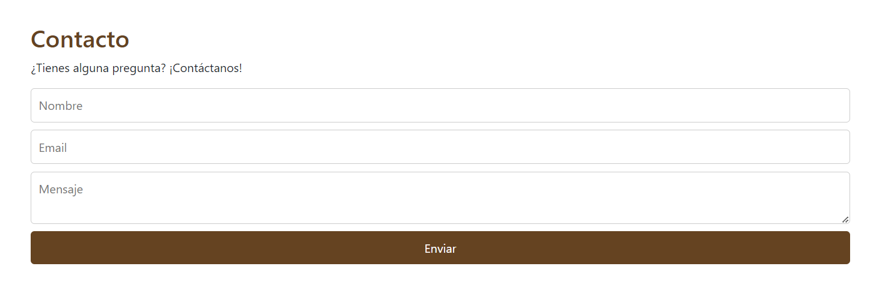
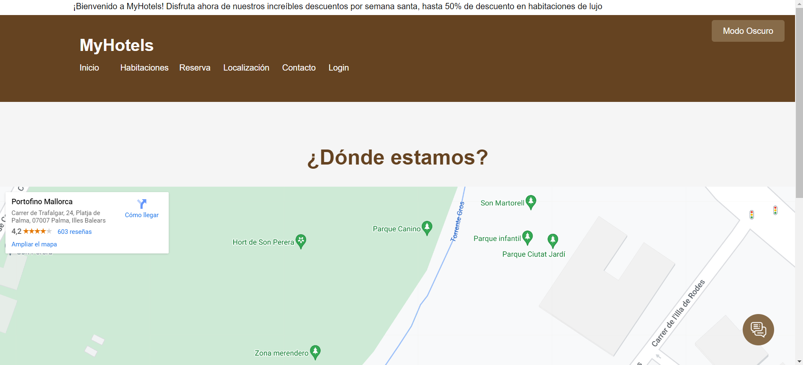
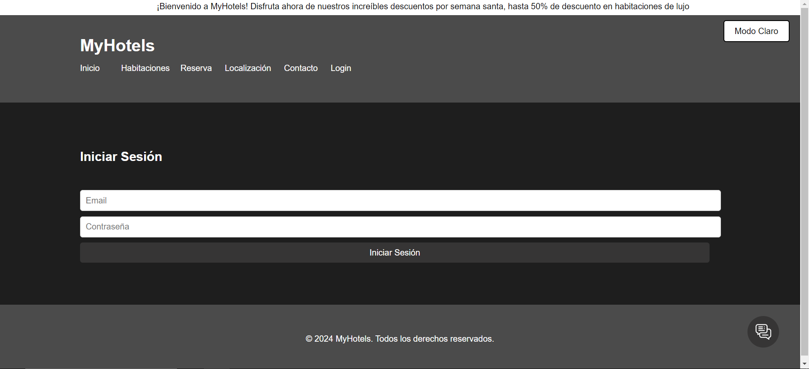
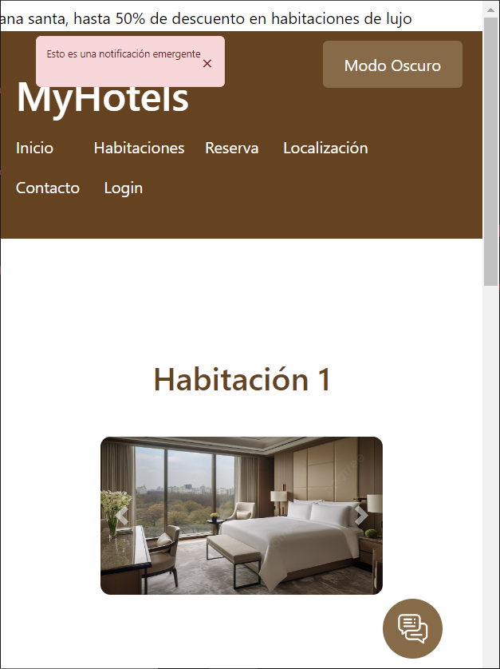
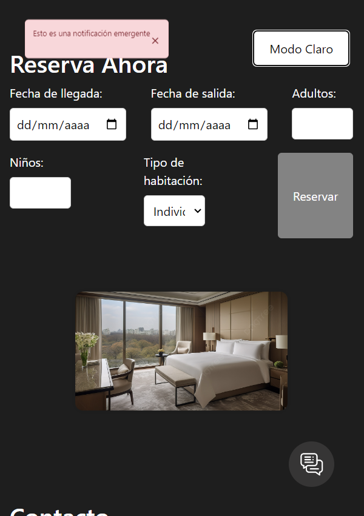

